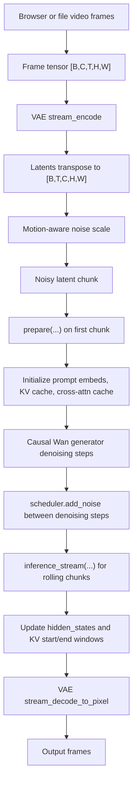

# StreamDiffusionV2 Semantic Avatar Integration Plan

This note prepares the upstream StreamDiffusionV2 checkout for incremental integration with the existing realtime semantic-avatar architecture. It intentionally avoids frontend redesign, semantic transport rewrites, PuLID, and mouth conditioning.

## Vanilla First Run

Run upstream unchanged on the target Linux RunPod GPU before adding any semantic adapter:

```bash
conda create -n streamdiffusionv2 python=3.10 -y
conda activate streamdiffusionv2
pip install .

huggingface-cli download --resume-download Wan-AI/Wan2.1-T2V-1.3B --local-dir wan_models/Wan2.1-T2V-1.3B
huggingface-cli download --resume-download jerryfeng/StreamDiffusionV2 --local-dir ./ckpts --include "wan_causal_dmd_v2v/*"

./run_v2v.sh single \
  --config_path configs/wan_causal_dmd_v2v.yaml \
  --checkpoint_folder ckpts/wan_causal_dmd_v2v \
  --output_folder outputs/vanilla_single \
  --prompt_file_path examples/prompt.txt \
  --video_path examples/original.mp4 \
  --height 480 \
  --width 832 \
  --fps 16 \
  --step 2
```

For online validation after the offline file path works:

```bash
cd demo
HOST=0.0.0.0 PORT=7860 python main.py --num_gpus 1 --gpu_ids 0 --step 2
```

Use `USE_TAEHV=1` only after baseline output quality and latency are confirmed.

## Repository Structure

- `streamdiffusionv2/pipeline.py`: readable staged Python API for single-GPU offline inference. Good for understanding chunk boundaries and writing future tests.
- `streamv2v/inference.py`: single-GPU stream-batch pipeline. This is the best first backend integration target.
- `streamv2v/inference_wo_batch.py`: single-GPU non-stream-batch variant. Useful fallback when stream-batch behavior complicates debugging.
- `streamv2v/inference_pipe.py`: multi-GPU pipeline-parallel path. Keep for later scaling, not first integration.
- `models/wan/causal_stream_inference.py`: core Causal DiT streaming inference, scheduler loop, KV cache, cross-attention cache, and hidden-state rolling logic.
- `models/wan/causal_model.py`: low-level rolling KV cache writes and sink-token behavior.
- `models/wan/wan_wrapper.py`: Wan model/VAE wrappers, including `stream_encode` and `stream_decode_to_pixel`.
- `demo/main.py`: FastAPI demo server. Existing websocket receives frame/control messages; output is MJPEG.
- `demo/vid2vid.py`: online single-GPU worker and multiprocessing queue bridge.
- `demo/vid2vid_pipe.py`: online multi-GPU worker bridge.
- `configs/*.yaml`: denoising schedule, frame block size, KV cache length, sink token count, and runtime model settings.

## Inference Flow



## Key Integration Points

1. Frame ingress: `demo/vid2vid.py::Pipeline.accept_new_params` converts PIL frames into arrays and pushes them into `input_queue`.
2. Online generation loop: `demo/vid2vid.py::generate_process` reads chunk-aligned image tensors, starts a stream session, then calls `run_stream_batch`.
3. VAE video input boundary: `streamv2v/inference.py::_timed_stream_encode` calls `pipeline.vae.stream_encode(images)`.
4. Denoising boundary: `streamv2v/inference.py::run_stream_batch` calls `pipeline.inference_stream(...)`.
5. Scheduler flow: `models/wan/causal_stream_inference.py::prepare`, `inference_stream`, and `inference_wo_batch` iterate `denoising_step_list` and call `scheduler.add_noise`.
6. Temporal cache: `models/wan/causal_stream_inference.py` owns `kv_cache1`, `crossattn_cache`, `hidden_states`, `kv_cache_starts`, and `kv_cache_ends`.
7. Rolling KV write policy: `models/wan/causal_model.py` updates cache indices and sink-token regions inside causal attention.

## Semantic-Avatar Extension Plan

Keep upstream video-to-video intact and add a narrow adapter beside it:

1. Add a server-side semantic adapter that consumes existing semantic packets and produces conditioning images/tensors with the same cadence as video frames.
2. First adapter output should be pose-map frames, not identity or mouth controls.
3. Feed generated pose maps through the same chunking contract currently used for image frames.
4. Add ControlNet/OpenPose conditioning only at the model conditioning boundary, not in the websocket or frontend.
5. Add identity embedding injection later as an optional conditioning provider after vanilla v2v and pose-conditioned v2v are stable.

Recommended abstraction:

```text
SemanticPacketStream
  -> PoseMapRenderer
  -> ConditioningFrameQueue
  -> StreamDiffusionV2OnlineWorker
```

The online worker should not know whether conditioning frames came from webcam RGB, cached upload frames, or semantic pose maps. That keeps the current frontend semantic stream and upstream StreamDiffusionV2 mostly independent.

## ControlNet and Identity Hooks

- ControlNet OpenPose: introduce after `stream_encode` has a stable replacement/source policy. The clean hook is around `SingleGPUInferencePipeline.run_stream_batch`, where image chunks, noise latents, prompt embeds, and current frame window are all available.
- Pose maps: keep as explicit tensors/images associated with each chunk. Avoid hiding them inside prompt text or websocket control messages.
- Semantic packets: terminate in a new backend adapter. Do not alter the browser packet schema until backend pose conditioning needs a field that does not already exist.
- Identity embeddings: future hook should be in `conditional_dict` or a sibling conditioning object passed into `generator(...)`, not in the frame transport.
- PuLID: defer until pose-conditioned generation produces stable timing and quality.
- Mouth conditioning: defer. Treat it as a second conditioning channel after pose maps and identity are proven.

## Minimal First-Step Modifications

1. Add a `semantic_avatar` backend module/package that is not imported by upstream entrypoints by default.
2. Add a config flag such as `--conditioning_source rgb|semantic_pose`, defaulting to `rgb`.
3. Add metrics around chunk queue delay, encode time, DiT time, decode time, output FPS, and end-to-end websocket latency.
4. Add one RunPod smoke script that performs: model check, offline v2v sample, online demo health check.

No model code changes are needed for the first step.

## RTX 3090/4090 Expectations

For 1.3B, 512x512, step 2, single stream:

- RTX 4090: expect usable realtime behavior around 8-16 FPS depending on TAEHV, TensorRT availability, queue policy, and prompt complexity.
- RTX 3090: expect roughly 5-10 FPS in the same mode, with VRAM pressure and decode cost more noticeable.
- 480x832 costs more than 512x512; start at 512x512 for realtime avatar validation, then raise resolution only after latency is stable.
- 14B is not the first target for single 3090/4090 realtime avatar work. Keep it for multi-GPU or offline quality comparisons.

The project page reports much higher H100 multi-GPU results; use those as architecture validation, not as 3090/4090 capacity planning.
